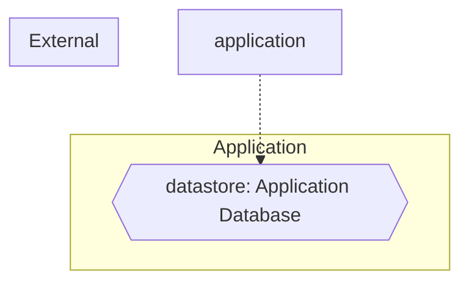

# Threat Model (auto-generated)

Generated by agentic-security on 2026-07-02.

This threat model is derived from static analysis of the current codebase and is regenerated on every scan. It is intended as a working artifact, not a finished compliance document.

## Entities + boundaries

## Assets

- **datastore**: Application Database — at `(global)`

## STRIDE threats

### Tampering (21)

- [medium] **dos-sync-io** (CWE-400) at `sectest/xss_active.js:undefined` — Synchronous Blocking I/O (DoS Risk in Server Context)
- [high] **weak-rng** (CWE-338) at `app.js:1230` — Insecure Randomness — Math.random() used for security-sensitive value
- [high] **sql-injection** (CWE-89) at `.claude/skills/ui-styling/scripts/tailwind_config_gen.py:128` — SQL Injection (f-string SQL assigned to variable)
- [high] **prompt-template-user-input-interpolated-** (CWE-1336) at `.claude/skills/ui-ux-pro-max/scripts/design_system.py:441` — Prompt Template: user input interpolated into prompt string without isolation
- [medium] **sensitive-data-logging** (CWE-532) at `app.js:605` — Sensitive Data Logged — PII-named variable sent to logger without sanitization
- [medium] **sensitive-data-logging** (CWE-532) at `app.js:634` — Sensitive Data Logged — PII-named variable sent to logger without sanitization
- [medium] **sensitive-data-logging** (CWE-532) at `app.js:823` — Sensitive Data Logged — PII-named variable sent to logger without sanitization
- [medium] **sensitive-data-logging** (CWE-532) at `app.js:1004` — Sensitive Data Logged — PII-named variable sent to logger without sanitization
- [medium] **sensitive-data-logging** (CWE-532) at `app.js:1217` — Sensitive Data Logged — PII-named variable sent to logger without sanitization
- [medium] **supply-chain** (CWE-353) at `index.html:3742` — Missing Subresource Integrity on cross-origin <script>
- [medium] **supply-chain** (CWE-353) at `index.html:3757` — Missing Subresource Integrity on cross-origin <script>
- [medium] **toctou-file-existence-permission-check-b** (CWE-367) at `.claude/skills/brand/scripts/extract-colors.cjs:43` — TOCTOU: file existence/permission check before open
- [medium] **toctou-file-existence-permission-check-b** (CWE-367) at `.claude/skills/brand/scripts/inject-brand-context.cjs:321` — TOCTOU: file existence/permission check before open
- [medium] **toctou-file-existence-permission-check-b** (CWE-367) at `.claude/skills/brand/scripts/sync-brand-to-tokens.cjs:197` — TOCTOU: file existence/permission check before open
- [medium] **toctou-file-existence-permission-check-b** (CWE-367) at `.claude/skills/brand/scripts/sync-brand-to-tokens.cjs:213` — TOCTOU: file existence/permission check before open
- [medium] **path-normalization** (CWE-176) at `.claude/skills/brand/scripts/validate-asset.cjs:66` — Path Normalization Gap — extension extraction without null-byte/traversal sanitization
- [medium] **toctou-file-existence-permission-check-b** (CWE-367) at `.claude/skills/brand/scripts/validate-asset.cjs:190` — TOCTOU: file existence/permission check before open
- [medium] **toctou-file-existence-permission-check-b** (CWE-367) at `.claude/skills/design-system/scripts/generate-tokens.cjs:178` — TOCTOU: file existence/permission check before open
- [medium] **path-normalization** (CWE-176) at `.claude/skills/design-system/scripts/validate-tokens.cjs:109` — Path Normalization Gap — extension extraction without null-byte/traversal sanitization
- [low] **supply-chain** (CWE-353) at `index.html:42` — Missing Subresource Integrity on cross-origin stylesheet
- [low] **supply-chain** (CWE-353) at `index.html:48` — Missing Subresource Integrity on cross-origin stylesheet

### Information Disclosure (2)

- [high] **ssrf** (CWE-918) at `sectest/xss_active.js:19` — SSRF — HTTP client request to a non-literal URL (JS/TS)
- [high] **sql-injection** (CWE-89) at `.claude/skills/ui-styling/scripts/tailwind_config_gen.py:128` — SQL Injection (f-string SQL assigned to variable)

### Elevation of Privilege (1)

- [high] **ssrf** (CWE-918) at `sectest/xss_active.js:19` — SSRF — HTTP client request to a non-literal URL (JS/TS)

## Attack trees

### Compromise datastore: Application Database
Severity rollup: **high**

- [high] Tampering via sql-injection (CWE-89) — `.claude/skills/ui-styling/scripts/tailwind_config_gen.py:128`
- [high] Information Disclosure via sql-injection (CWE-89) — `.claude/skills/ui-styling/scripts/tailwind_config_gen.py:128`
